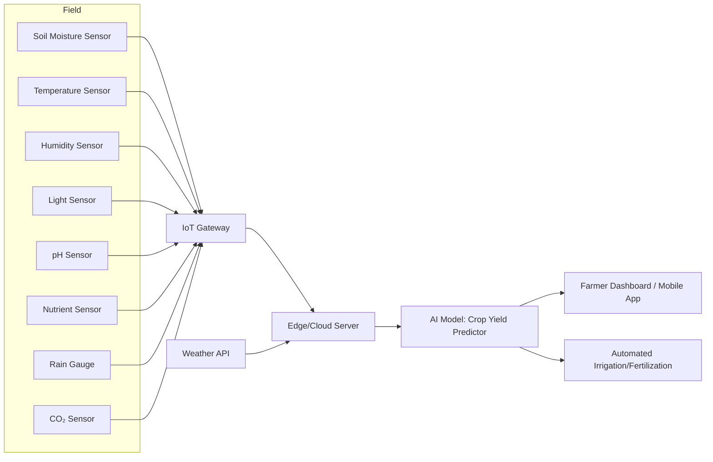

# Smart Agriculture System: AI-Driven IoT Concept

## Overview

This proposal outlines a smart agriculture system that leverages IoT sensors and AI to optimize crop management and predict yields. The system enables real-time monitoring, data-driven decision-making, and efficient resource utilization for farmers.

## 1. Required Sensors

- Soil Moisture Sensor: Monitors soil water content for irrigation management.
- Temperature Sensor: Tracks ambient and soil temperature.
- Humidity Sensor: Measures air humidity, affecting plant transpiration.
- Light Sensor (PAR/Photodiode): Monitors sunlight exposure.
- pH Sensor: Measures soil acidity/alkalinity.
- Rain Gauge: Detects rainfall events.
- Nutrient Sensor (NPK): Monitors soil nutrient levels.
- CO₂ Sensor: Measures greenhouse gas concentration.
- Weather Station: Collects wind speed/direction and atmospheric pressure.

## 2. AI Model for Crop Yield Prediction

- Model Type: Regression (e.g., Random Forest Regressor, Gradient Boosting, or a lightweight Neural Network)
- Inputs: Aggregated sensor data (moisture, temperature, humidity, light, pH, nutrients), weather forecasts historical yield data.
- Output: Predicted crop yield (kg/ha or tons/acre) for the current season.
- Features: Time-series analysis, anomaly detection, and adaptive learning for changing conditions.

## 3. Data Flow Diagram

## 4. Summary

- Sensors collect real-time environmental and soil data.
- IoT Gateway aggregates and transmits data to the cloud or edge server.
- AI Model processes sensor and weather data to predict crop yields and recommend actions.
- Dashboard provides insights and alerts to farmers.
- Automated Actuators (optional) enable precision irrigation and fertilization.

Benefits:

- Improved yield prediction accuracy
- Optimized resource usage (water, fertilizer)
- Early detection of crop stress
- Data-driven farm management
